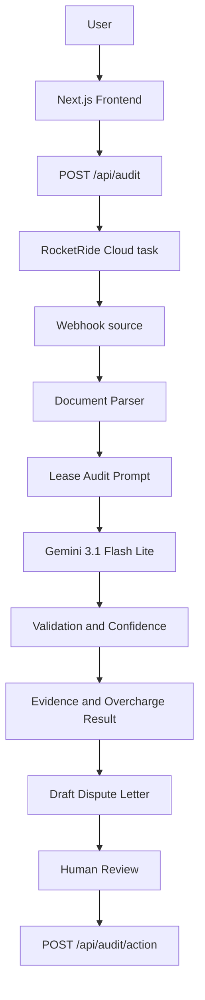

# LeaseAudit AI

LeaseAudit AI compares a lease agreement with a landlord invoice to identify potential overcharges and return evidence-backed audit findings for human review.

## The Problem

Commercial tenants often receive operating-expense and pass-through charges that are difficult to verify. Manually comparing each invoice line with a long lease agreement is slow, repetitive, and easy to get wrong. Unsupported charges or incorrect escalations can be missed.

LeaseAudit AI is designed to make this first-pass review faster and more explainable by connecting each finding to the lease evidence used in the audit.

## The Solution

The current application accepts two PDF documents:

```text
Lease Agreement + Landlord Invoice
                |
                v
       Document processing
                |
                v
       RocketRide audit pipeline
                |
                v
      Gemini AI lease audit
                |
                v
 Validation, confidence, evidence,
 overcharge calculation, and letter
                |
                v
       Human Approve or Reject
```

The output is an audit result containing the extracted lease rules, invoice charges, allowed-versus-billed comparison, potential overcharges, supporting evidence, confidence information, a total disputed amount, and a draft dispute letter.

## How It Works

1. **Upload**: The browser collects a lease PDF and a landlord invoice PDF. Both are required before the audit can start.
2. **Submit**: The Next.js API receives the multipart upload and starts or reuses the configured RocketRide task.
3. **Process documents**: The RocketRide pipeline receives the PDF files through its webhook-source workflow and parses their contents.
4. **Audit with Gemini**: The pipeline sends the parsed material to the configured Gemini 3.1 Flash Lite preview profile using the existing audit prompt.
5. **Validate and explain**: The pipeline returns the audit response, including confidence, evidence, comparisons, and the calculated disputed amount.
6. **Review**: The frontend renders the response as Markdown, highlights summary amounts, and presents the generated letter as a draft.
7. **Resolve**: A reviewer can approve or reject the findings. These actions call the application's review-action API and update the UI state.

## RocketRide

RocketRide is the workflow and orchestration layer for the document audit. The deployed pipeline uses a webhook source and connects document parsing, prompting, Gemini execution, validation, and the final answers response into one workflow.

The Next.js server connects to RocketRide Cloud using the configured server environment variables, starts or reuses the task, and sends both PDF files to that task. RocketRide coordinates the connected processing steps; it is not used as a simple Gemini API wrapper.

## AI

The pipeline's Gemini component uses the `gemini-3_1-flash-lite-preview` profile. Gemini is used for the lease and invoice extraction, comparison, evidence-based findings, confidence statements, and draft dispute letter returned by the existing pipeline prompt.

The application displays the model response and does not replace it with hard-coded audit figures.

## Human-in-the-Loop

Lease disputes can affect payments and landlord relationships, so the generated letter is explicitly presented as a draft requiring human review. The reviewer can:

- **Approve & Send Letter**: Records an approved review action and updates the interface to show the approved state.
- **Reject Findings**: Records a rejected review action and updates the interface to show the rejected state.

The current project does not implement email delivery or an external landlord communication service.

## Key Features

- Lease agreement PDF upload
- Landlord invoice PDF upload
- RocketRide Cloud webhook workflow
- Document parsing through the existing pipeline
- Gemini-powered lease and invoice audit
- Lease-rule and invoice-charge extraction
- Allowed-versus-billed comparison
- Potential overcharge calculation
- Supporting lease evidence
- Confidence and validation information
- Generated draft dispute letter
- Markdown and table rendering for audit results
- Human Approve and Reject actions
- User-facing validation and failure messages

## Tech Stack

| Area | Technology |
| --- | --- |
| Frontend | Next.js 16.3.3, React 19, TypeScript |
| Audit result rendering | `react-markdown`, `remark-gfm` |
| AI workflow client | RocketRide TypeScript SDK |
| AI pipeline | RocketRide `lease_audit.pipe` with Gemini 3.1 Flash Lite preview |
| Runtime | Node.js-compatible Next.js server |

## Architecture



## Project Structure

```text
.
├── app/
│   ├── api/
│   │   └── audit/
│   │       ├── action/route.ts   # Approve and reject actions
│   │       └── route.ts          # PDF upload and RocketRide execution
│   ├── globals.css               # Global visual styles
│   ├── layout.tsx                # Root layout and metadata
│   ├── page.module.css           # Dashboard and upload styles
│   └── page.tsx                  # Upload dashboard
├── components/
│   └── AuditResults.tsx           # Result, evidence, letter, and review UI
├── lib/
│   └── rocketride-discovery.ts    # RocketRide endpoint discovery helper
├── lease_audit.pipe               # Existing RocketRide pipeline
├── sample_lease_agreement.pdf     # Sample lease input
├── sample_landlord_invoice.pdf    # Sample invoice input
├── package.json
├── next.config.ts
└── tsconfig.json
```

## Local Development

Requirements: Node.js and npm.

```bash
npm install
npm run dev
```

Open `http://localhost:3000` in a browser.

For a production build and local production server:

```bash
npm run build
npm run start
```

## Environment Variables

Configure these values in a local environment file such as `.env.local`. Keep that file private and never commit it.

```env
ROCKETRIDE_APIKEY=your_rocketride_key_here
ROCKETRIDE_URI=https://api.rocketride.ai
ROCKETRIDE_GEMINI_APIKEY=your_gemini_key_here
```

The application server reads `ROCKETRIDE_APIKEY` and `ROCKETRIDE_URI`. The pipeline uses the `ROCKETRIDE_GEMINI_APIKEY` environment reference for the Gemini provider credential. `ROCKETRIDE_WEBHOOK_URL` is not required by the current application route.

## Deployment

The RocketRide workflow is deployed to RocketRide Cloud and uses its webhook-source task architecture. The Next.js frontend is deployed separately as a Vercel application with the RocketRide values configured as server-side environment variables.

Frontend deployment URL: https://rocketride-lease-audit.vercel.app

The RocketRide webhook endpoint is a backend workflow endpoint, not the frontend website URL.

## How to Demo

1. Open the application.
2. Upload `sample_lease_agreement.pdf` as the lease agreement.
3. Upload `sample_landlord_invoice.pdf` as the landlord invoice.
4. Select **Run AI Audit**.
5. Review the extracted rules, charges, and findings.
6. Review evidence, confidence, and the disputed amount.
7. Review the generated draft dispute letter.
8. Choose **Approve & Send Letter** or **Reject Findings**.

## Sample Inputs

The repository includes `sample_lease_agreement.pdf` and `sample_landlord_invoice.pdf` for demonstration. No financial figures are documented here because the audit values are generated from the live pipeline response rather than stored as a static fixture.

## Security

- Store RocketRide and Gemini credentials in environment variables or the deployment provider's secret configuration.
- Never commit `.env.local` or any other environment file containing secrets.
- Never place API keys, bearer tokens, or webhook credentials in browser code, the README, or logs.
- Rotate credentials if they have previously been exposed.
- Review generated findings and the draft letter before approving an action.

## Limitations

This is an MVP focused on a two-document PDF audit. It relies on the configured RocketRide pipeline and Gemini response for extraction and comparison. The current application does not provide portfolio-level auditing, recurring reconciliation, an external case-management system, email delivery, or a deterministic accounting rules engine. Results should be reviewed by a qualified human before payment or dispute action.

## Future Roadmap

Potential future directions, separate from the implemented MVP:

- Portfolio-level and multi-property auditing
- Recurring reconciliation monitoring
- Stronger deterministic validation alongside model findings
- Recovery and savings tracking
- Additional document formats and OCR workflows
- Case history and audit export management

## Hackathon Value

LeaseAudit AI is aimed at commercial tenants, lease administrators, and finance or property-operations teams that need to review landlord charges. It turns a slow manual comparison into an explainable workflow with evidence attached to findings.

RocketRide provides the orchestration layer that connects document processing, AI reasoning, validation, and final answers in a portable pipeline. Gemini creates value by extracting and comparing the relevant lease and invoice information. Human approval remains part of the design because financial disputes require accountability.

A possible future business model is a percentage of recovered overcharges. That is a Buildathon concept, not current revenue or an implemented billing feature.

## Team / Demo Links

- GitHub Repository: https://github.com/karansingh012/-lease-audit-engine
- Live Demo: https://rocketride-lease-audit.vercel.app
- RocketRide Pipeline: _Add pipeline URL or project reference_
- Demo Video: _Add video URL_

## License

No license is specified in the current repository.
